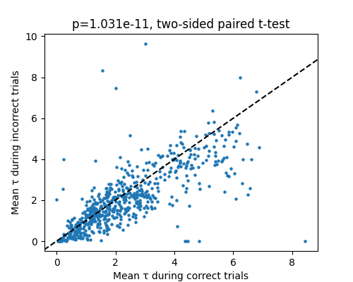

# Single neuron timescales during correct vs. incorrect trials: preliminary analysis

## Summary

- We hypothesized that neural activity would be more "stable" during trials in which the mouse made the correct decision
- As an initial assessment, we compare the autocorrelation timescales of neurons during correct vs. incorrect trials in a single session
- We did not see evidence for a systematic shift in timescales during correct vs. incorrect trials. Some individual neurons showed a difference in timescales; however, not all of the recorded neurons may be even involved in the decision making process

## To reproduce

```
python -m venv .venv # create a virtual environment
source .venv/bin/activate # activate environment
pip install -r requirements.txt # use lockfile to instantiate environment (note that this depends on a local dev install of decisive-times-utils)
python compare_timescales.py # run!
```

## Results

- There is a strong correlation between a neuron's timescale during correct and incorrect trials, indicating most neurons' timescales are relatively stable
- On average, the observed timescales were slightly longer during correct trials (2.39 seconds) vs. incorrect trials (2.06 seconds). This was statistically significant (p=1.03e-11, two-sided paired t-test)



## Limitations

- We only analyzed a single session
- We only looked at the dominant timescale for each neuron, and didn't check whether the exponential fits were any good at all (we might not be doing a great job capturing the timescale)
- The timescale estimates are limited by the duration of the trial, since we compute the autocorrelation for each trial independently. Therefore, this analysis will ignore timescales longer than a trial that could be relevant (attention/arousal states?)
- We don't account for any difference in trial length / reaction time in correct vs. incorrect trials, if they exist
- This session included many more correct than incorrect trials, so incorrect estimates could be particularly noisy

## Next steps

- Validate autocorrelation methodology in more detail
- Check if reaction time (or some other confound) explains the difference
- Explore other sessions
- Subset to neurons that are correlated with relevant parameters: visual stimulus, mouse behavior, decision, reaction time, etc.
